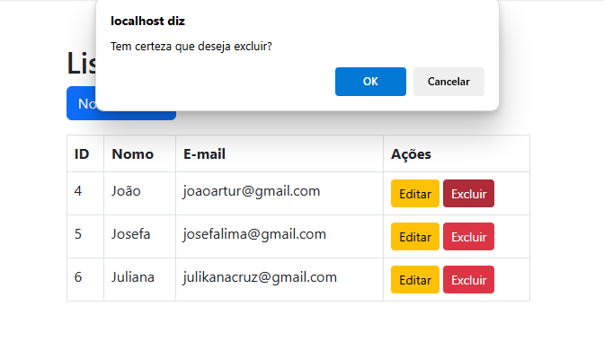

# Gerenciador de Usuários

Este projeto é uma aplicação web simples para gerenciar usuários. Ele permite que você liste, adicione, edite e exclua usuários em um banco de dados MySQL. A interface foi construída com o framework Bootstrap para um design responsivo e intuitivo.

## Funcionalidades

- Listar todos os usuários cadastrados.
- Adicionar novos usuários com informações como nome, e-mail, senha e data de nascimento.
- Editar as informações de usuários existentes.
- Excluir usuários do sistema.

## Tecnologias Utilizadas

- **PHP**: Para desenvolvimento do back-end.
- **MySQL**: Para armazenamento dos dados.
- **Bootstrap 5**: Para estilização e design responsivo.
- **HTML**: Para estruturação das páginas.
- **JavaScript**: Para interação básica na interface (como confirmação de exclusão).

## Pré-requisitos

Certifique-se de que o ambiente de desenvolvimento atenda aos seguintes requisitos:

1. Servidor web (como Apache ou Nginx).
2. PHP 7.4 ou superior.
3. Banco de dados MySQL.
4. Composer (opcional, mas útil para gerenciar dependências).

## Configuração

1. Clone este repositório:

https://github.com/carladanielaa/CRUD-PHP.git

2. configure o banco de dados:
 - Crie um banco de dados chamado cadastros no MYSQL.
 - Execute o seguinte script SQL para criar a tabela usuarios:

 ## Criar Tabela de Usuários

```sql
CREATE TABLE usuarios (
    id INT AUTO_INCREMENT PRIMARY KEY,
    nome VARCHAR(100) NOT NULL,
    email VARCHAR(100) NOT NULL UNIQUE,
    senha VARCHAR(255) NOT NULL,
    data_nasc DATE NOT NULL
);
````
## Configurar a Conexão com o Banco de Dados no Arquivo `config.php`

```php
$host = 'localhost';
$user = 'root';
$password = ''; // Ajuste a senha conforme necessário
$database = 'cadastros';

````
## Iniciar o Servidor Local

```php
php -S localhost:8000

````
## Estrutura do Projeto
```php

|-- config.php            # Configuração da conexão com o banco de dados
|-- index.php             # Página principal que lista os usuários
|-- novo-usuario.php      # Página para cadastrar um novo usuário
|-- editar-usuario.php    # Página para editar informações de um usuário
|-- salvar-usuario.php    # Script para salvar as operações de CRUD

````
## Prints do Sistema
1. **Página Inicial (Lista de Usuários)
Apresenta os usuários cadastrados em uma tabela:


2.**Cadastro de Usuário (novo-usuario.php):
Exiba o formulário usado para cadastrar um novo usuário.


3. **Edição de Usuário (editar-usuario.php):
Inclua um print do formulário de edição.


4. **Confirmação de Exclusão:
   Demonstre a janela de confirmação ao excluir um usuário.
   
   
````
## Contribuições
Contribuições são bem-vindas! Se encontrar problemas ou tiver ideias de melhorias, sinta-se à vontade para:
1. Abrir uma issue.
2. Enviar um pull request com a sua contribuição.

## Licença

Este projeto está licenciado sob a Licença MIT. Consulte o arquivo LICENSE para mais detalhes.

````
## Desenvolvido por Carla Daniela.
